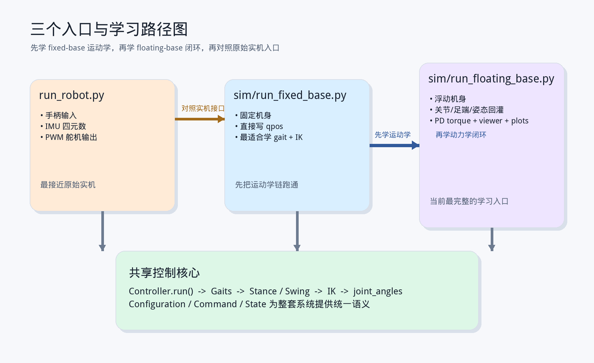

# StanfordQuadruped 第 1 讲讲义：项目全景、入口与控制主循环

这份讲义对应系列课程的第 1 讲，目标是先把项目整体地图搭起来，让观众在进入控制细节前，先知道仓库结构、运行入口和核心数据对象分别是什么。

建议时长：35~45 分钟

主文件：

- `README.md`
- `run_robot.py`
- `sim/run_floating_base.py`
- `src/Command.py`
- `src/State.py`
- `pupper/Config.py`

## 本讲目标

- 先建立“这到底是什么类型的四足控制器”的判断
- 看懂仓库四层结构，以及为什么今天最适合从仿真入口学起
- 讲清楚 `Command`、`State`、`Configuration` 三个关键数据对象
- 把 `run_robot.py` 的主循环讲成观众能复述出来的一条链

## 这一讲的开场定位

开场最重要的一句话是：

> 这个项目不是 MPC，不是 WBC，也不是强化学习策略部署框架；它是一个典型的 gait + 足端规划 + IK + 执行器桥接的工程型四足控制器。

这句话一定要先立住。因为只有先把项目的“控制范式”说清楚，后面讲步态、IK、仿真，观众才不会拿错误预期去看代码。

## 本讲必须带观众认清的目录

- `run_robot.py`
  - 原始实机入口，负责把手柄、IMU、控制器和硬件接口串起来
- `src/`
  - 控制核心层，真正的 gait、stance、swing、状态切换都在这里
- `pupper/`
  - 几何、舵机、PWM、标定参数所在层
- `sim/`
  - 复用同一套控制器，但把实机换成 MuJoCo 的教学/实验入口
- `woofer/`
  - 更大机器人分支，用来说明“共享控制思想 + 平台相关后端”的边界

## 你要建立的第一张系统图

```flow
run_robot.py
  -> JoystickInterface
  -> Command
  -> Controller.run()
  -> state.joint_angles
  -> HardwareInterface

sim/run_floating_base.py
  -> TaskCommandSource
  -> Command
  -> Controller.run()
  -> SimHardwareInterface
  -> MuJoCo
  -> SimObservationInterface
  -> State
```

这张图的意义是让观众明白：

- 实机入口和仿真入口复用的是同一个控制器核心
- 变化的不是 gait / stance / IK，而是“命令来源”和“执行器/观测后端”
- 所以当前项目最好的教学视角，其实是“从仿真看共享控制核心，再回头理解实机”

## 三个最该先认识的数据对象

- `src/Command.py`
  - 存一拍内的期望速度、姿态和离散事件
- `src/State.py`
  - 存跨拍持续维护的控制器状态、足端位置、关节角、姿态和观测量
- `pupper/Config.py`
  - 存所有控制参数、几何参数、步态参数和仿真参数

建议在视频里强调一个工程判断：

- `Command` 是“这一拍想做什么”
- `State` 是“系统现在认为自己在哪”
- `Configuration` 是“算法和平台的固定参数集合”

## `run_robot.py` 要讲的四个点

1. 它是原始运行时主入口
2. 它自己几乎不做控制计算，重点在于 orchestration
3. 它使用 `config.dt` 做固定周期控制
4. 它先等 `L1` 激活，再进入主循环，再按 `L1` 退出

可以直接把主链压缩成下面的伪代码：

```python
config = Configuration()
hardware = HardwareInterface()
controller = Controller(config, four_legs_inverse_kinematics)
state = State()
joystick = JoystickInterface(config)

while active:
    command = joystick.get_command(state)
    state.quat_orientation = imu.read_orientation() or [1, 0, 0, 0]
    controller.run(state, command)
    hardware.set_actuator_postions(state.joint_angles)
```

## 这一讲顺手指出的工程细节

- `run_robot.py` 末尾直接调用 `main()`，不是可导入入口
- 控制循环用的是忙等式定时，不是更优雅的调度器
- IMU 是可选的，没有 IMU 时会退回单位四元数
- 这也是为什么今天更建议先从 `sim/run_floating_base.py` 学起

## 为什么今天最推荐从 MuJoCo 入口开始

- 不依赖真实硬件
- 能看到机身和地面的真实互动
- 能直接读出机身姿态、速度、触地和关节状态
- 能做 headless 回归
- 更适合讲“控制器如何复用”和“状态怎样回灌”



## 本讲建议演示

如果环境已安装依赖，可演示：

```bash
python sim/run_fixed_base.py --mode rest --duration 10
python sim/run_fixed_base.py --mode trot --duration 10
python sim/run_floating_base.py --mode rest --duration 10
```

如果要提醒依赖，可以顺手说：

```bash
pip install numpy transforms3d mujoco
```

## 本讲作业

- 让观众自己画出一拍控制循环图
- 让观众解释 `Command` / `State` / `Configuration` 的区别
- 让观众回答：为什么 `sim/run_floating_base.py` 比 `run_robot.py` 更适合作为教学入口
