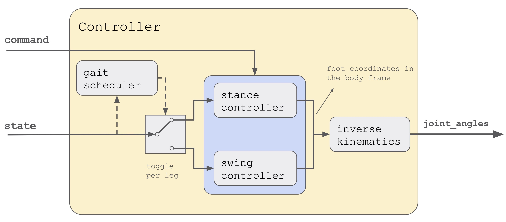

# StanfordQuadruped 项目 B 站五讲课程讲义

这份讲义面向当前仓库本身，目标不是泛泛而谈“四足机器人是什么”，而是把 `StanfordQuadruped` 这套代码真正拆开，整理成 5 次适合录制成系列视频的课程。

整套课程围绕一条主线展开：

```flow
输入命令
  -> Command
  -> Controller
  -> gait scheduler
  -> stance / swing 足端规划
  -> inverse kinematics
  -> joint angles
  -> 实机 PWM 或 MuJoCo PD
  -> 机器人状态
  -> State
  -> 再回到 Controller
```

## 适合对象

- 想借一个真实开源项目入门四足控制的人
- 已能运行当前仓库，但还没形成完整源码地图的人
- 想讲清“命令 -> 足端 -> IK -> 执行器 -> 反馈”主链的人
- 想把这套仓库继续扩展成课程、实验平台或毕设底座的人

## 建议先修

- 欧拉角、四元数、旋转矩阵的基本直觉
- 逆运动学的基本三角几何
- PD 控制、低通滤波、离散时间控制循环
- MuJoCo 或至少“仿真闭环”概念

## 课程总目标

- 搭起整个仓库的四层结构地图
- 看懂 `run_robot.py`、`src/`、`pupper/`、`sim/` 的职责分工
- 讲清楚 `Controller.run()` 是怎样组织状态机、步态和足端轨迹的
- 讲清楚 `pupper/Kinematics.py` 怎样把足端目标变成 12 个关节角
- 讲清楚 MuJoCo 版为什么是当前最好的教学入口
- 给出一条从仿真走向实机、从阅读走向扩展的路线


## 五讲总览

1. 第 1 讲：项目全景、入口与控制主循环
   - 建议时长：35~45 分钟
   - 主文件：`README.md`、`run_robot.py`、`sim/run_floating_base.py`、`src/Command.py`、`src/State.py`
   - 关键词：工程分层、入口文件、控制循环、数据对象、学习路径
2. 第 2 讲：控制器内核、状态机与步态调度
   - 建议时长：35~45 分钟
   - 主文件：`src/Controller.py`、`src/Gaits.py`、`pupper/Config.py`
   - 关键词：BehaviorState、事件触发、相位、接触表、REST/TROT/HOP
3. 第 3 讲：足端规划、Raibert 落脚点与逆运动学
   - 建议时长：40~50 分钟
   - 主文件：`src/StanceController.py`、`src/SwingLegController.py`、`pupper/Kinematics.py`
   - 关键词：支撑相、摆动相、足端坐标、三角波抬脚、IK、姿态补偿
4. 第 4 讲：MuJoCo 闭环仿真、状态回灌与调参
   - 建议时长：40~50 分钟
   - 主文件：`sim/run_fixed_base.py`、`sim/run_floating_base.py`、`sim/sim_robot.py`、`sim/task_scheduler.py`
   - 关键词：fixed-base、floating-base、观测桥接、PD 力矩、任务序列、实时遥测
5. 第 5 讲：实机接口、Sim2Real 与二次开发路线
   - 建议时长：35~45 分钟
   - 主文件：`src/JoystickInterface.py`、`pupper/HardwareInterface.py`、`src/IMU.py`、`install.sh`
   - 关键词：UDP 手柄、pigpio、舵机标定、IMU、部署、重构与扩展

---

## 第 1 讲：项目全景、入口与控制主循环

### 本讲目标

- 先建立“这到底是什么类型的四足控制器”的判断
- 看懂仓库四层结构，以及为什么今天最适合从仿真入口学起
- 讲清楚 `Command`、`State`、`Configuration` 三个关键数据对象
- 把 `run_robot.py` 的主循环讲成观众能复述出来的一条链

### 这一讲的开场定位

开场最重要的一句话是：

> 这个项目不是 MPC，不是 WBC，也不是强化学习策略部署框架；它是一个典型的 gait + 足端规划 + IK + 执行器桥接的工程型四足控制器。

这句话一定要先立住。因为只有先把项目的“控制范式”说清楚，后面讲步态、IK、仿真，观众才不会拿错误预期去看代码。

### 本讲必须带观众认清的目录

- `run_robot.py`
  - 原始实机入口，负责把手柄、IMU、控制器和硬件接口串起来
- `src/`
  - 控制核心层，真正的 gait、stance、swing、状态切换都在这里
- `pupper/`
  - 几何、舵机、PWM、标定参数所在层
- `sim/`
  - 复用同一套控制器，但把实机换成 MuJoCo 的教学/实验入口
- `woofer/`
  - 更大机器人分支，用来说明“共享控制思想 + 平台相关后端”的边界

### 你要建立的第一张系统图

```flow
run_robot.py
  -> JoystickInterface
  -> Command
  -> Controller.run()
  -> state.joint_angles
  -> HardwareInterface

sim/run_floating_base.py
  -> TaskCommandSource
  -> Command
  -> Controller.run()
  -> SimHardwareInterface
  -> MuJoCo
  -> SimObservationInterface
  -> State
```

这张图的意义是让观众明白：

- 实机入口和仿真入口复用的是同一个控制器核心
- 变化的不是 gait / stance / IK，而是“命令来源”和“执行器/观测后端”
- 所以当前项目最好的教学视角，其实是“从仿真看共享控制核心，再回头理解实机”

### 三个最该先认识的数据对象

- `src/Command.py`
  - 存一拍内的期望速度、姿态和离散事件
- `src/State.py`
  - 存跨拍持续维护的控制器状态、足端位置、关节角、姿态和观测量
- `pupper/Config.py`
  - 存所有控制参数、几何参数、步态参数和仿真参数

建议在视频里强调一个工程判断：

- `Command` 是“这一拍想做什么”
- `State` 是“系统现在认为自己在哪”
- `Configuration` 是“算法和平台的固定参数集合”

### `run_robot.py` 要讲的四个点

1. 它是原始运行时主入口
2. 它自己几乎不做控制计算，重点在于 orchestration
3. 它使用 `config.dt` 做固定周期控制
4. 它先等 `L1` 激活，再进入主循环，再按 `L1` 退出

可以直接把主链压缩成下面的伪代码：

```python
config = Configuration()
hardware = HardwareInterface()
controller = Controller(config, four_legs_inverse_kinematics)
state = State()
joystick = JoystickInterface(config)

while active:
    command = joystick.get_command(state)
    state.quat_orientation = imu.read_orientation() or [1, 0, 0, 0]
    controller.run(state, command)
    hardware.set_actuator_postions(state.joint_angles)
```

### 这一讲顺手指出的工程细节

- `run_robot.py` 末尾直接调用 `main()`，不是可导入入口
- 控制循环用的是忙等式定时，不是更优雅的调度器
- IMU 是可选的，没有 IMU 时会退回单位四元数
- 这也是为什么今天更建议先从 `sim/run_floating_base.py` 学起

### 为什么今天最推荐从 MuJoCo 入口开始

- 不依赖真实硬件
- 能看到机身和地面的真实互动
- 能直接读出机身姿态、速度、触地和关节状态
- 能做 headless 回归
- 更适合讲“控制器如何复用”和“状态怎样回灌”


### 本讲建议演示

如果环境已安装依赖，可演示：

```bash
python sim/run_fixed_base.py --mode rest --duration 10
python sim/run_fixed_base.py --mode trot --duration 10
python sim/run_floating_base.py --mode rest --duration 10
```

如果要提醒依赖，可以顺手说：

```bash
pip install numpy transforms3d mujoco
```

### 本讲作业

- 让观众自己画出一拍控制循环图
- 让观众解释 `Command` / `State` / `Configuration` 的区别
- 让观众回答：为什么 `sim/run_floating_base.py` 比 `run_robot.py` 更适合作为教学入口

---

## 第 2 讲：控制器内核、状态机与步态调度

### 本讲目标

- 从 `Controller.run()` 看懂整套控制决策的骨架
- 讲清楚 `BehaviorState` 怎样随手柄/任务事件切换
- 讲清楚 `GaitController` 怎样把时间分成步态相位
- 让观众知道四条腿为什么会形成对角小跑

### 先给观众一个判断

`src/Controller.py` 不是一个只做“控制律”的文件，它其实同时承担了：

- 行为状态机
- gait 分派
- stance / swing 路由
- 姿态补偿
- 逆运动学调用

所以看这个项目，真正的核心不是单个公式，而是 `Controller.run()` 这一个函数。

### 行为状态机必须讲清楚

状态枚举定义在 `src/State.py`：

- `DEACTIVATED`
- `REST`
- `TROT`
- `HOP`
- `FINISHHOP`

而事件来自两处：

- 实机：`JoystickInterface`
- 仿真：`TaskCommandSource`

状态切换逻辑建议直接用口头规则讲：

- `activate_event`：`DEACTIVATED <-> REST`
- `trot_event`：`REST <-> TROT`，也允许从跳跃相关态直接切到 `TROT`
- `hop_event`：`REST -> HOP -> FINISHHOP -> REST`

### `Controller.run()` 的主干要怎么讲

最稳的讲法是按状态分支讲。

#### `TROT`

- 先调用 `step_gait()` 更新足端目标
- 再叠加命令里的期望 `roll / pitch`
- 再用 IMU 做有限的机身倾斜补偿
- 最后做四腿逆运动学，得到 12 个关节角

#### `REST`

- 保持默认站姿
- 允许调高度、滚转、俯仰和缓变偏航
- 偏航不是一步到位，而是走一阶滤波

#### `HOP / FINISHHOP`

- 这两个分支没有复杂轨迹
- 本质是用两组不同高度的静态足端位置实现压缩与回落
- 很适合顺手讲“这个项目的跳跃并不是动力学最优控制”

### `step_gait()` 是理解腿级逻辑的关键

这部分一定要讲成下面的结构：

```flow
for 每条腿:
  先看当前 contact_mode
    -> 1: 走 StanceController
    -> 0: 走 SwingController
```

它告诉观众一件很重要的事：

- 控制器不是“对机器人整体算一次动作”
- 而是每一拍都要分别决定四条腿当前属于支撑相还是摆动相

### `GaitController` 的三个函数

- `phase_index(ticks)`
  - 当前属于 4 个步态相位中的哪一相
- `subphase_ticks(ticks)`
  - 当前子相已经走了多少 tick
- `contacts(ticks)`
  - 当前 4 条腿的接触模式

这里最值得当场推一遍的，是 `Configuration` 里的相位参数：

```python
dt = 0.01
overlap_time = 0.10
swing_time = 0.15
```

由此得到：

- `overlap_ticks = 10`
- `swing_ticks = 15`
- 一个周期总长度 `phase_length = 50`

### 对角小跑的接触表怎么讲

`contact_phases` 是本项目最值得展示的一段参数：

```text
FR: 1 1 1 0
FL: 1 0 1 1
BR: 1 0 1 1
BL: 1 1 1 0
```

这说明：

- `FL + BR` 同时摆动
- `FR + BL` 同时摆动
- 两组对角腿交替工作

这里就是讲“为什么这是 trot，而不是 walk / pace / bound”的最好位置。

### 这一讲建议观众记住的概念

- 步态是“时间组织方式”，不是“某个关节轨迹”
- 状态机决定宏观模式
- gait 决定每条腿此刻属于 stance 还是 swing
- `ticks` 是整个控制器的时间基准

### 本讲建议演示

建议用浮动机身版演示“进入 trot 前先 settle”：

```bash
python sim/run_floating_base.py --duration 8 --mode trot --settle 1.0 --no-plots
```

也可以直接演示任务序列：

```bash
python sim/run_floating_base.py --duration 8 \
  --task-sequence "rest:1.0,trot:4.0,rest" --no-plots
```

### 本讲作业

- 让观众根据参数自己算一个 gait 周期有多少 tick
- 让观众解释对角腿为什么会同时抬起
- 让观众画出 `REST / TROT / HOP` 的切换图

---

## 第 3 讲：足端规划、Raibert 落脚点与逆运动学

### 本讲目标

- 看懂 `StanceController` 和 `SwingController` 的几何意义
- 把“机身速度命令”翻译成“足端相对机身应该怎么动”
- 讲清楚 Raibert 落脚点启发式
- 讲清楚 `pupper/Kinematics.py` 怎样把足端位置变成关节角



### 先讲清一个关键坐标直觉

这个项目里的足端规划，大部分都在“机身坐标系下”进行。

所以观众必须理解：

- 控制器不是先求世界坐标系里的脚轨迹
- 而是先维护“脚相对于机身”的位置
- 真正要让机器人前进时，脚在机身坐标里往后划，身体在世界里才会向前走

### `StanceController` 的直觉

支撑相里，脚在地上不想乱飞，所以它做的是“相对机身向后划地”。

代码里的核心直觉可以压缩成：

```flow
期望机身前进
  -> 足端在机身坐标中向后移动

期望机身转向
  -> 足端绕 z 轴做反向旋转

期望高度回到目标值
  -> 足端 z 方向缓慢收敛
```

如果要讲公式，最值得讲的是这三件事：

- `v_xy = -command.horizontal_velocity`
- `delta_R = yaw_rate * dt` 对应的反向旋转
- `z_time_constant` 用来把足端高度拉回目标高度

### `SwingController` 的直觉

摆动相里，脚要完成三件事：

- 抬起来
- 向新的落脚点移动
- 按时落下

当前实现非常工程化：

- 抬脚高度走一个三角波
- `x / y` 朝落脚点匀速逼近
- `z` 直接由 `swing_height + command.height` 给出

这意味着它不是最平滑的高阶轨迹，但非常清楚、容易教、容易改。

### Raibert 落脚点一定要讲成“工程启发式”

`raibert_touchdown_location()` 的意义是：

- 机器人前进越快，落脚点越应该往前放
- 转向越快，落脚点越应该做额外偏航旋转补偿

代码中最值得讲的两个系数：

- `alpha`
  - 决定水平速度对落脚点前后偏移的影响
- `beta`
  - 决定偏航速度对落脚点旋转补偿的影响

可以引导观众记住一句话：

> Raibert 不是“精确最优控制”，而是一个在足式机器人里非常经典、非常实用的落脚点启发式。

### `pupper/Kinematics.py` 怎么讲最顺

建议按“先减去腿原点偏移，再解单腿 IK”的顺序讲。

四腿 IK 的结构其实很整齐：

```flow
四足足端矩阵 (3x4)
  -> 每条腿减去自身安装原点
  -> 单腿解析逆解
  -> 输出 3x4 关节角矩阵
```

单腿逆解重点不是推满全部三角关系，而是讲清几个几何量：

- 足端在 `y-z` 平面的投影距离
- 外展偏移 `ABDUCTION_OFFSET`
- 髋到足端的空间距离
- 由余弦定理得到的髋角和膝角

如果要讲成视频，建议把难点压成一句话：

> 这套 IK 不是数值优化，而是解析几何；它依赖已知的机身尺寸、腿长和外展偏移，直接算三个关节角。

### `Controller` 里的姿态补偿不要漏掉

在 `TROT` 分支里，控制器会根据 IMU 的 `roll / pitch` 做倾斜补偿：

- 先从四元数提取欧拉角
- 再对 `roll / pitch` 做裁剪
- 乘以固定系数后，反向作用到足端目标

这里可以顺带告诉观众：

- 这是“轻量姿态补偿”，不是完整姿态控制器
- 作用是减弱机身倾斜对足端目标的破坏
- 它非常适合作为“闭环味道”的入门示例

### 本讲建议演示

先做固定机身，便于观众只看足端与 IK：

```bash
python sim/run_fixed_base.py --mode rest --pitch 0.15 --roll 0.10
python sim/run_fixed_base.py --mode trot --x-vel 0.15 --yaw-rate 0.6
```

再演示浮动机身里 `z_clearance` 的影响：

```bash
python sim/run_floating_base.py --duration 8 --mode trot \
  --z-clearance 0.05 --no-plots
```

### 本讲作业

- 让观众解释“为什么机身前进时，支撑足要在机身坐标里往后走”
- 让观众解释 `alpha` 变大后落脚点会发生什么变化
- 让观众自己画一条摆动相三角波高度轨迹

---

## 第 4 讲：MuJoCo 闭环仿真、状态回灌与调参

### 本讲目标

- 讲清楚固定机身版和浮动机身版分别在学什么
- 看懂 `sim/sim_robot.py` 是怎样把 MuJoCo 包装成“像机器人一样”的接口
- 讲清楚状态回灌、PD 力矩驱动和任务调度的意义
- 给出一套真实可用的调参顺序

### 为什么第 4 讲才进入仿真细节

因为前 3 讲已经把共享控制核心讲完了。到了这一步再讲 MuJoCo，观众更容易意识到：

- 仿真不是另一套控制器
- 仿真是“控制器核心 + 仿真后端 + 观测桥接”的组合

### `run_fixed_base.py` 和 `run_floating_base.py` 的分工

#### 固定机身版

- 把控制器输出的关节角直接写入 `qpos`
- 不引入关节力矩、机身动力学和状态回灌
- 最适合检查 IK、足端轨迹和姿态命令

#### 浮动机身版

- 机身使用 `freejoint`
- 关节由 PD 力矩驱动
- MuJoCo 里的姿态、速度、关节状态和触地回写到 `State`
- 最适合讲真正的闭环和调参


### `sim/sim_robot.py` 是本讲的灵魂文件

这一个文件里其实放了五个桥接模块：

- `SimObservationInterface`
  - 把 MuJoCo 传感器写回 `State`
- `SimIMU`
  - 让仿真也长得像实机 IMU
- `SimHardwareInterface`
  - 把关节目标变成 PD 力矩
- `SimControlClock`
  - 按控制周期推进多个仿真子步
- `TaskCommandSource`
  - 不依赖 UDP 手柄，直接在本地生成 `Command`

### `sync_state()` 为什么很值得讲

观众通常第一次真正理解“闭环”，就是在这里。

`sync_state()` 做了这些事：

- 读机身位置、姿态、速度、角速度
- 读足端位置和触地传感器
- 读关节角和关节角速度
- 更新 `state.measured_*`
- 把部分测量值融合回 `state.foot_locations`

这里一定要强调：

- 这个项目不是“纯开环轨迹播放”
- 它在仿真里已经有了明确的状态回灌


### `SimHardwareInterface` 怎么讲

它的意义很简单：

- 控制器仍然输出的是关节目标角
- 仿真执行器不是舵机 PWM，而是 MuJoCo motor
- 所以需要一层 `target_qpos -> PD torque` 的桥接

这层桥接刚好也能顺手讲两个控制直觉：

- `kp` 太小，跟踪软
- `kp` 太大、`kd` 不够时，系统容易振荡

### `TaskScheduler` 和 `TaskCommandSource` 很适合录视频

这是当前仓库里最“教学友好”的新能力。

它解决的问题是：

- 没有手柄时，怎样安排一串可重复的实验
- 怎样把 `rest -> trot -> rest` 做成固定流程
- 怎样在不同时间片里覆盖 `vx / height / z_clearance / overlap_time`

任务语法可以直接给观众：

```text
mode[:duration][@key=value;key=value...],mode[:duration],...
```

比如：

```bash
python sim/run_floating_base.py --duration 8 \
  --task-sequence "rest:1.0,trot:4.0@vx=0.08;z_clearance=0.04,rest" \
  --no-plots
```

### 本讲最推荐的调参顺序

1. 先固定 `rest`，确认姿态和初始高度正常
2. 再用 `fixed-base` 验证足端轨迹和 IK
3. 再切到 `floating-base`，先小速度前进
4. 再调 `kp / kd / torque-limit`
5. 再调 `overlap_time / swing_time / z_clearance`
6. 最后再引入 `attitude_kp / attitude_kd / velocity_kp`

### 最适合在视频里展示的症状与解释

- 机身前倾过大
  - 看 `pitch`、`attitude_kp` 和 `velocity_kp`
- 腿拖地
  - 看 `z_clearance`
- 前进发虚或不肯走
  - 看 `kp`、`torque-limit` 和 `vx`
- 容易摔
  - 看 `overlap_time` 是否太小、速度是否太大

### 本讲建议演示

```bash
python sim/run_floating_base.py --duration 8 --mode rest --no-plots
python sim/run_floating_base.py --duration 8 --mode trot --settle 1.0
python sim/run_floating_base.py --duration 8 \
  --task-sequence "rest:1.0,trot:4.0@vx=0.08;attitude_kp=0.03;velocity_kp=0.2,rest"
```

### 本讲作业

- 设计一条三段任务序列并解释每段目的
- 让观众自己回答：为什么 fixed-base 和 floating-base 要分开学
- 让观众写出一套最小调参顺序

---

## 第 5 讲：实机接口、Sim2Real 与二次开发路线

### 本讲目标

- 讲清楚实机运行链里哪些部分和仿真不同
- 看懂 `JoystickInterface`、`HardwareInterface`、IMU、部署脚本的角色
- 给出从仿真迁移到实机的注意事项
- 说明这个项目接下来该怎么扩展，而不是只停留在“能跑”

### 实机链路怎么讲最清楚

建议直接讲成下面这条路径：

```flow
PS4 手柄
  -> UDP 消息
  -> JoystickInterface
  -> Command
  -> Controller
  -> joint angles
  -> HardwareInterface
  -> pigpio PWM
  -> 舵机
```

### `JoystickInterface.py` 的重点

- 订阅 UDP 手柄消息
- 把摇杆映射成 `horizontal_velocity / yaw_rate / pitch / height / roll`
- 把 `L1 / R1 / X` 做成边沿触发事件
- 对 `pitch` 做死区和一阶限速滤波
- 对 `height / roll` 做基于当前状态的积分式调节

这里很适合顺手讲一个工程观念：

> 好的输入层不是“原样转发手柄值”，而是先完成命令整形，再交给控制器。

### `HardwareInterface.py` 的重点

- 建立和本机 `pigpio` 守护进程的连接
- 维护 PWM 引脚、频率和范围
- 通过中立位姿和方向符号把关节角映射到舵机 PWM

这部分要强调：

- 数学模型里的关节零位，不等于真实舵机的机械零位
- 所以必须有 `ServoCalibration`
- `servo_multipliers` 用来处理不同腿、不同关节的转向差异

### IMU 与闭环补偿

`run_robot.py` 里 IMU 是可选的，但它很有教学价值，因为它说明：

- 这个项目原始设计就预留了姿态反馈入口
- 即便不是复杂状态估计器，也已经不是纯开环结构

所以第 5 讲可以把它讲成：

- 一个最小但真实存在的闭环接口
- 一个从“纯几何 gait”向“轻量姿态反馈 gait”迈出的第一步

### 安装与部署要怎么讲

`install.sh` 展示了实机版所依赖的外部世界：

- `numpy / transforms3d / pigpio / pyserial`
- `PupperCommand`
- `PS4Joystick`
- `robot.service`

这部分很适合拿来告诉观众：

- 仓库不是孤立运行的
- 实机机器人一定伴随驱动、服务、外部进程和系统级依赖

### 从仿真到实机时最容易踩的坑

- 舵机中位和机械装配偏差
- 仿真里稳定的 `kp / kd` 到真实舵机上不一定等价
- 地面摩擦、足端接触、机身重量分布会发生变化
- 手柄输入是异步网络消息，和仿真里的本地任务源不同


### 第 5 讲必须给出的扩展路线

如果希望观众看完后真的能继续做项目，建议明确给出下面 5 个方向：

1. 先做工程清理
   - 给 `run_robot.py` 增加 `if __name__ == "__main__"`
   - 把忙等循环改成更稳定的定时方式
2. 再做日志和观测
   - 为 `Command`、`State`、触地和机身姿态加统一日志
3. 再做控制改造
   - 替换摆腿轨迹
   - 增加新的步态表
   - 增强姿态反馈
4. 再做平台抽象
   - 更明确地拆分 command source / hardware interface / observation interface
5. 最后再上更复杂的方法
   - 阻抗、力控制、WBC、MPC、学习策略

### 这一讲最适合布置的结课项目

- 项目 1：自己加一种新的任务序列和回归脚本
- 项目 2：把摆动相轨迹从三角波改成更平滑的曲线
- 项目 3：在仿真里增加更多实时可视化量
- 项目 4：做一次 `sim -> real` 参数迁移记录
- 项目 5：把控制器主循环重构成更可测试的形式

### 本讲建议演示

如果在实机环境下，可以演示：

```bash
python run_robot.py
```

如果没有实机，建议用第 4 讲仿真收尾，并口头说明：

- 哪些模块是共享的
- 哪些模块到实机必须替换

### 本讲作业

- 让观众自己总结“共享控制核心”和“平台相关后端”的边界
- 让观众提出一个最想扩展的方向，并说明会改哪些文件
- 让观众解释：为什么这个项目特别适合作为课程/毕设底座

---

## 统一录制建议

整套 5 讲最推荐统一使用下面的录制模板：

1. 先给现象和目标
   - 这一讲到底回答什么问题
2. 再给架构图
   - 保证观众先知道自己要去哪里
3. 再读源码
   - 只抓最关键文件，不要漫游式读代码
4. 再做演示
   - 让观众把图、代码、现象三者对上
5. 最后留作业
   - 迫使观众把这一讲复述出来

建议每讲都坚持一条节奏：

```flow
现象
  -> 架构
  -> 源码
  -> 参数
  -> 演示
  -> 总结
```

## 高频问题与答法

- 这个项目为什么不是 MPC / WBC？
  - 因为它的主链是 gait + 足端规划 + IK，不是全身动力学优化。
- 为什么第一个入口不直接讲 `run_robot.py`？
  - 因为仿真入口更容易观察状态、做回归和控制实验。
- 为什么 fixed-base 和 floating-base 都要保留？
  - 一个适合看几何和 IK，一个适合看闭环和动力学。
- 这个项目为什么适合教学？
  - 结构清晰，层次完整，复杂度正好够讲清主链，又没有一下子上到过重的动力学优化。
- 观众下一步应该学什么？
  - 先把这套工程主链讲通，再继续去看阻抗、WBC、MPC 或学习控制。

## 附录：推荐的阅读顺序

```flow
README.md
  -> sim/run_floating_base.py
  -> run_robot.py
  -> src/Command.py
  -> src/State.py
  -> src/Controller.py
  -> src/Gaits.py
  -> src/StanceController.py
  -> src/SwingLegController.py
  -> pupper/Kinematics.py
  -> sim/sim_robot.py
  -> pupper/HardwareInterface.py
```

## 附录：建议在课程里反复出现的关键文件

- `run_robot.py`
- `sim/run_fixed_base.py`
- `sim/run_floating_base.py`
- `sim/sim_robot.py`
- `src/Controller.py`
- `src/Gaits.py`
- `src/StanceController.py`
- `src/SwingLegController.py`
- `src/JoystickInterface.py`
- `pupper/Config.py`
- `pupper/Kinematics.py`
- `pupper/HardwareInterface.py`

## 附录：一句话总结整套课

这 5 讲的最终目标，不是把观众训练成“会背术语的人”，而是让他们真正能从当前仓库出发，讲清主链、跑起仿真、读懂控制器，并知道下一步该怎么扩展。
