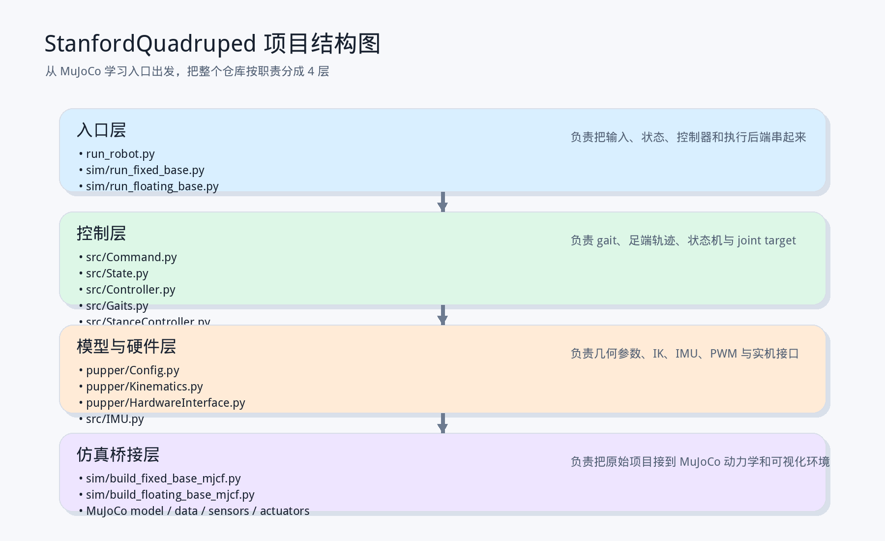
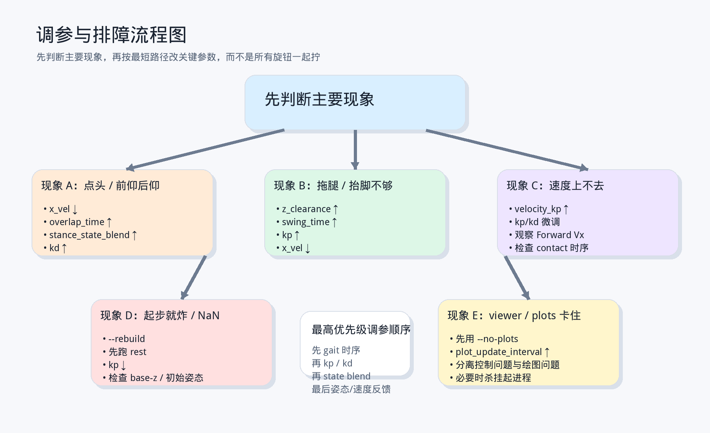
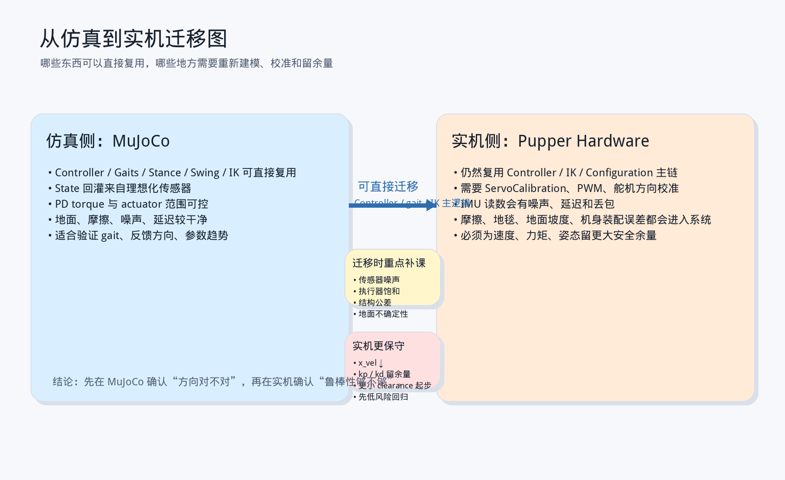
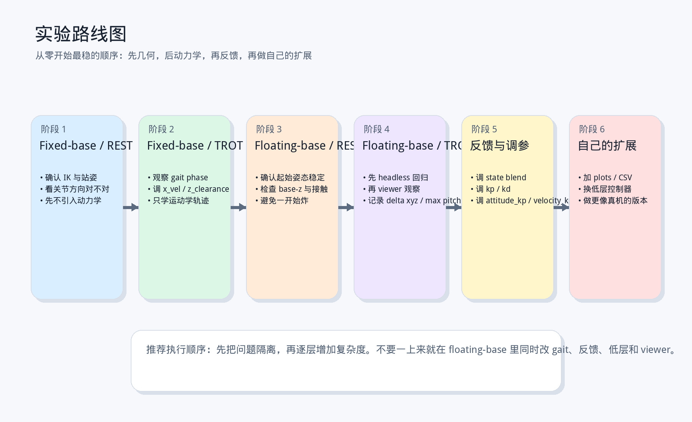
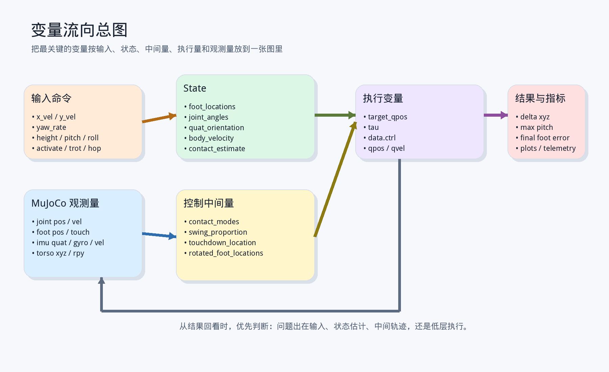

# MuJoCo 版 StanfordQuadruped 从零到精通教程

这份教程面向当前仓库本身，目标不是只解释某一个脚本，而是从你现在最常用的入口 `sim/run_floating_base.py` 出发，把整个项目完整地串起来讲清楚：

- 这个仓库到底是什么类型的四足控制系统
- 原始实机入口 `run_robot.py` 和 MuJoCo 入口有什么关系
- `src/` 里的控制器究竟怎样组织 gait、stance、swing、IK
- `pupper/` 里的几何、参数和硬件接口怎样接到实机
- `sim/` 里的固定机身和浮动机身版本怎样帮助你逐级学习
- 从“能跑起来”到“能稳定调、能解释、能扩展”应该怎么学

如果你已经看过：

- `docs/stanford_quadruped_tutorial/stanford_quadruped_tutorial.md`
- `docs/quadruped_motion_control_tutorial/quadruped_motion_control_tutorial.md`

你可以把这篇文档理解成：

> 把“通用四足控制教程”和“原始 StanfordQuadruped 项目解读”升级成一个以 MuJoCo 学习入口为起点、但覆盖整个当前仓库的总教程。

---

## 适合对象

- 刚接触四足机器人，希望先把一条能跑通的工程主链看明白的人
- 已经能运行 `sim/run_floating_base.py`，但还没把整个仓库结构串起来的人
- 想从运动学控制一路学到仿真闭环、状态回灌、调参与排障的人
- 想继续把这个项目往“更像真机”的方向扩展的人

## 你将得到什么

- 一条从 `sim/run_floating_base.py` 出发的源码阅读路线
- 一套“命令 -> gait -> 足端 -> IK -> 执行器 -> 状态反馈”的统一心智模型
- 对 `run_robot.py`、`src/`、`pupper/`、`sim/` 四层结构的完整理解
- 一套可直接照着做的实验顺序、调参顺序、排障顺序

## 推荐使用方式

- 第 1 遍：通读，先建立整套项目地图
- 第 2 遍：只抓入口、控制器、gait、IK、MuJoCo 五条主线
- 第 3 遍：边读边跑 `fixed-base -> floating-base` 实验
- 第 4 遍：按文末训练计划做自己的修改和回归

## 建议先修知识

- 基本三维坐标变换和欧拉角
- 简单 PD 控制直觉
- 三连杆/二连杆逆运动学直觉
- 一点点接触与状态反馈概念

> 学习建议：这份教程最适合“看一章、跑一组实验、再回来看源码”的节奏。

---

## 10 分钟速览：你到底在学什么

如果你现在只有 10 分钟，请先记住这几个层级。

- 级别 0：知道这个项目不是 MPC / WBC，而是 gait + 足端规划 + IK 的工程型控制器
- 级别 1：能从 `sim/run_floating_base.py` 运行起来，并看懂主要参数
- 级别 2：知道 `Command`、`State`、`Configuration` 三个核心数据对象
- 级别 3：知道 `Controller.run()` 怎样切状态、算 gait、给足端目标、再做 IK
- 级别 4：知道 `run_fixed_base.py` 和 `run_floating_base.py` 分别在学什么
- 级别 5：知道 MuJoCo 的关节/足端/姿态怎样回灌到控制器
- 级别 6：能调 `x_vel / overlap_time / swing_time / kp / kd / blend / task-sequence / transition-time` 这类参数
- 级别 7：能解释系统为什么稳、为什么不稳、为什么点头、为什么拖腿
- 级别 8：能自己加低层控制器、加状态估计、加更完整可视化
- 级别 9：能把这个项目当成一个完整的四足学习平台来扩展

---

## 目录

- 第 1 章：先建立项目整体地图
- 第 2 章：仓库分层与阅读顺序
- 第 3 章：三个入口文件分别负责什么
- 第 4 章：三类核心数据对象：`Command`、`State`、`Configuration`
- 第 5 章：控制核心 `Controller.run()` 怎样工作
- 第 6 章：步态调度 `Gaits.py`
- 第 7 章：支撑相控制 `StanceController.py`
- 第 8 章：摆动相控制 `SwingLegController.py`
- 第 9 章：逆运动学 `pupper/Kinematics.py`
- 第 10 章：实机执行链：硬件接口、IMU、PWM
- 第 11 章：MuJoCo 学习链：固定机身、浮动机身、状态回灌
- 第 12 章：`sim/run_floating_base.py` 作为总学习入口
- 第 13 章：从零开始跑实验
- 第 14 章：调参与排障手册
- 第 15 章：从仿真到实机、从项目到研究
- 第 16 章：从零到精通的训练计划
- 附录：变量流向、最小伪代码、实验清单、源码阅读导航

---

## 第 1 章：先建立项目整体地图

很多人第一次看这类仓库时，会被目录和文件名带偏：

- 一会儿看 `run_robot.py`
- 一会儿看 `src/Controller.py`
- 一会儿又跳到 `sim/run_floating_base.py`
- 最后脑子里没有一条真正贯通的链

这个项目最适合先压缩成下面这条主线：

```flow
用户命令
  -> Command
  -> Controller
  -> gait scheduler
  -> stance / swing 足端规划
  -> inverse kinematics
  -> joint angles
  -> 实机 PWM 或 MuJoCo torque
  -> 机器人运动
  -> 传感器状态
  -> State
  -> 再回到 Controller
```

如果只说一句话，这个项目属于：

- 不是全身动力学最优控制器
- 不是接触力分配求解器
- 不是强化学习策略推理框架
- 而是一个非常典型的 gait + 足端轨迹 + IK + 执行器桥接系统

这意味着它非常适合拿来学：

- 四足机器人最核心的工程控制主链
- 步态时序和足端规划怎样驱动整机前进
- 怎样把一个原本偏实机的项目接到 MuJoCo 里做学习环境

不太适合直接拿来学的是：

- Whole-Body Control 的任务层优化
- 严格的接触力 QP
- 高速动态跳跃的最优控制



### 1.1 从今天的入口开始看整套系统

你现在最常接触的入口是：

```flow
sim/run_floating_base.py
```

但它不是孤立存在的。

你应该把它理解成：

```flow
sim/run_floating_base.py
  -> 复用 src/Controller.py
  -> 复用 pupper/Kinematics.py
  -> 复用 pupper/Config.py
  -> 用 MuJoCo 替代真实机器人本体
  -> 用传感器回灌替代原始弱状态输入
```

所以它看起来是“仿真脚本”，实际上是这个项目当前最适合教学的总入口。

### 1.2 这套系统的四层结构

如果从工程分层看，这个仓库大致可以分成 4 层：

```flow
入口层
  -> run_robot.py
  -> sim/run_fixed_base.py
  -> sim/run_floating_base.py

控制层
  -> src/Command.py
  -> src/State.py
  -> src/Controller.py
  -> src/Gaits.py
  -> src/StanceController.py
  -> src/SwingLegController.py

模型与硬件层
  -> pupper/Config.py
  -> pupper/Kinematics.py
  -> pupper/HardwareInterface.py
  -> src/IMU.py

仿真桥接层
  -> sim/build_fixed_base_mjcf.py
  -> sim/build_floating_base_mjcf.py
  -> MuJoCo sensors / actuators / viewer
```

后面整份教程，基本都会围绕这四层来讲。

---

## 第 2 章：仓库分层与阅读顺序

这类项目最怕“乱读”。

最自然的阅读顺序不是按目录字母顺序，而是按控制链顺序。

### 2.1 先看哪几个文件

最推荐的顺序是：

```flow
sim/run_floating_base.py
  -> run_robot.py
  -> src/Command.py
  -> src/State.py
  -> src/Controller.py
  -> src/Gaits.py
  -> src/StanceController.py
  -> src/SwingLegController.py
  -> pupper/Kinematics.py
  -> pupper/Config.py
  -> sim/build_floating_base_mjcf.py
  -> pupper/HardwareInterface.py
```

原因很简单：

- 先知道系统怎么启动
- 再知道系统里流动的核心数据是什么
- 再知道控制逻辑怎么组织
- 再知道数学模型和硬件/仿真怎样接上

### 2.2 这个仓库里哪些地方有“历史味”

这个仓库不是一个从头到尾一体化重构过的现代工程。

它有一些明显的“历史演化痕迹”：

- `run_robot.py` 文件末尾直接调用 `main()`
- `src/State.py` 是后来随着仿真扩展不断加字段的
- `src/Tests.py` 里保留了不少很老的测试草稿
- `woofer/` 是另一条更大机器人分支，不是这篇教程主线

这些都不影响学习，但你要知道：

> 这是一个非常适合教学与二次开发的项目，不是一个已经完全产品化、完全清理过历史包袱的仓库。

### 2.3 为什么这篇教程从 `sim/run_floating_base.py` 开始

因为它比 `run_robot.py` 更适合作为今天的学习入口。

`run_robot.py` 的优点是更原始、更接近真实系统；
但 `sim/run_floating_base.py` 对学习者更友好：

- 不需要真实硬件
- 能看到机身和地面的物理互动
- 能直接做 headless 回归
- 能把关节、足端、机身状态真正读出来
- 能用曲线面板观察 `pitch / vx / contact`

所以最好的学习姿势是：

```flow
先从 run_floating_base.py 建立整体地图
  -> 再回头理解 run_robot.py
  -> 再深入 src/Controller.py
```


---

## 第 3 章：三个入口文件分别负责什么

当前仓库里，真正值得重点区分的入口有 3 个。

### 3.1 `run_robot.py`：原始实机入口

它的主线是：

```flow
JoystickInterface
  -> Command
  -> IMU
  -> Controller.run()
  -> HardwareInterface.set_actuator_postions()
```

这个入口几乎不做控制算法本身。

它负责的事情是：

- 创建 `Configuration`
- 创建 `HardwareInterface`
- 可选创建 `IMU`
- 创建 `Controller`
- 创建 `State`
- 创建 `JoystickInterface`
- 跑固定频率循环

它代表的是：

- 真实机器人运行时的最小工程骨架

### 3.2 `sim/run_fixed_base.py`：固定机身学习入口

这个文件的教学意义非常大。

它做的事情比浮动机身版本简单很多：

- 仍然复用 `Controller + IK`
- 但不做自由机身动力学
- 直接把关节角写进 MuJoCo 模型
- 主要用来学习 gait 和运动学轨迹本身

所以它最适合：

- 第一次确认 IK 桥接没问题
- 第一次看 trot 的脚在怎样按相位动
- 把问题隔离到“几何规划层”，先不被动力学干扰

你可以把它理解成：

```flow
Controller output
  -> directly write qpos
  -> 看足端几何轨迹对不对
```

### 3.3 `sim/run_floating_base.py`：当前最完整的学习入口

这个文件是本教程的主入口。

它比固定机身多了 8 类关键能力：

- 浮动机身自由度
- 仿真侧任务层：`TaskScheduler + TaskCommandSource`
- 机器人风格适配层：`SimObservationInterface / SimIMU / SimHardwareInterface / SimControlClock`
- MuJoCo 传感器读数
- 关节/足端/姿态/速度状态回灌
- 关节 PD 力矩执行
- 段间平滑过渡和局部参数覆盖
- viewer + telemetry + live plots

它的主线是：

```flow
parse_args
  -> build/load MJCF
  -> initialize_controller
  -> create sim adapters
  -> create TaskScheduler / TaskCommandSource
  -> set_initial_pose
  -> observation.sync_state
  -> apply task-step config
  -> get_command
  -> apply_feedback
  -> controller.run
  -> set_actuator_postions
  -> hardware_interface.step
  -> viewer / telemetry / plots
```

所以如果你只准备在这个仓库里精读一个入口，那就优先精读它。

---

## 第 4 章：三类核心数据对象：`Command`、`State`、`Configuration`

所有四足项目里，最值得先记住的通常不是函数，而是数据。

这个仓库也一样。

### 4.1 `Command`：外部想让机器人做什么

`src/Command.py` 非常小，但它定义了整个系统的“输入语义”。

它的核心字段是：

```pseudo
horizontal_velocity = [vx, vy]
yaw_rate
height
pitch
roll
hop_event
trot_event
activate_event
```

也就是说，这套系统的高层命令可以概括成：

```flow
速度命令
  + 姿态/高度命令
  + 离散模式切换事件
```

这很重要，因为很多更复杂的系统最后也还是会落到类似抽象上。

但在当前 MuJoCo 架构里，`Command` 上面已经又多了一层任务调度：

```flow
TaskScheduler
  -> TaskCommandSource
  -> Command
  -> Controller
```

也就是说：

- `Command` 仍然是控制器唯一认识的输入格式
- 但谁来生成这一拍的 `Command`，现在已经可以是“任务序列 + 局部参数 + 平滑过渡”，不再只是一次静态命令

### 4.2 `State`：系统当前认为机器人处于什么状态

`src/State.py` 里保存的是控制器内部长期流动的状态。

原始字段主要有：

- `horizontal_velocity`
- `yaw_rate`
- `height`
- `pitch`
- `roll`
- `activation`
- `behavior_state`
- `ticks`
- `foot_locations`
- `joint_angles`

为了 MuJoCo 学习环境，当前仓库又扩展了：

- `joint_velocities`
- `measured_foot_locations`
- `measured_joint_angles`
- `measured_joint_velocities`
- `quat_orientation`
- `body_position`
- `body_velocity`
- `angular_velocity`
- `foot_forces`
- `contact_estimate`

所以现在的 `State` 已经不只是“规划状态容器”，更像一个简化版的整机状态总线。

### 4.3 `Configuration`：系统的结构常数和控制参数

`pupper/Config.py` 是整个项目最关键的参数总表。

里面几乎把所有行为相关参数都集中起来了：

- 最大速度与最大 yaw 速度
- 姿态命令滤波和限速
- 机体几何尺寸
- 腿长与偏置
- gait 相位表和相位时长
- 默认站姿
- 惯量、质量和部分仿真参数

如果你学会了怎么看 `Configuration`，就会很快明白：

- 系统能走多快
- 步态时序是怎样定义的
- 默认站姿几何是怎样来的
- IK 用的腿长和机体尺寸是什么

### 4.4 这三个对象怎样连起来

最简化的关系是：

```flow
Command
  -> 告诉 Controller 想干什么

State
  -> 告诉 Controller 机器人现在怎样

Configuration
  -> 告诉 Controller 应该按什么参数和几何规则去做
```

这三者的关系如果你记住了，后面看源码会轻松很多。

---

## 第 5 章：控制核心 `Controller.run()` 怎样工作

如果整个项目只能看一个文件，那优先看 `src/Controller.py`。

### 5.1 它的本质不是一个函数，而是一个状态机 + 规划器

`Controller.run()` 不是传统意义上的一个“单一控制律函数”。

它做了两类事情：

- 先根据事件切行为状态
- 再根据当前状态执行不同的足端/姿态/IK 逻辑

它内部核心行为状态有：

```pseudo
DEACTIVATED
REST
TROT
HOP
FINISHHOP
```

而且切换关系是直接用映射表写出来的：

- `activate_transition_mapping`
- `trot_transition_mapping`
- `hop_transition_mapping`

这意味着它很工程化、很直接，也意味着后期扩更多 gait 时需要更系统的状态机设计。

### 5.2 `REST` 状态在做什么

`REST` 下，它主要做：

- 根据 `yaw_rate` 平滑更新一个 `smoothed_yaw`
- 用 `default_stance + command.height` 设定站姿
- 根据 `roll / pitch / smoothed_yaw` 旋转机身相对足端位置
- 做 IK 得到关节角

你可以把它理解成：

```flow
站立模式
  -> 足端保持默认站姿
  -> 机身姿态相对足端旋转
  -> IK 得关节角
```

这就是这个项目里最基本的“姿态控制入门层”。

### 5.3 `TROT` 状态在做什么

`TROT` 是最值得重点研究的部分。

它做的事情是：

```flow
step_gait()
  -> 根据 gait phase 决定每条腿 stance 还是 swing
  -> stance 腿交给 StanceController
  -> swing 腿交给 SwingController
  -> 得到新的 foot_locations

再做机身姿态相关旋转
  -> 再做 IMU 倾斜补偿
  -> 最后做 IK
```

也就是说，在这个项目里：

- gait 负责节奏
- stance/swing 控制器负责足端目标
- IK 负责把足端目标变成关节目标

### 5.4 IMU 倾斜补偿很值得注意

`TROT` 模式里还有一段容易被忽略、但教学价值很大的逻辑：

```flow
从 state.quat_orientation 读出 roll / pitch
  -> 限幅
  -> 乘补偿系数
  -> 生成补偿旋转矩阵
  -> 把脚相对机身的位置反向修一下
```

这不是完整状态估计闭环，但已经不是纯开环几何 gait。

它体现了一个很重要的工程思想：

> 就算整体结构主要是 gait + IK，仍然可以在机身姿态层插入轻量反馈，让系统更稳。

### 5.5 `HOP` 和 `FINISHHOP`

这两个状态本质上是：

- 给一个更低或更特殊的足端参考姿态
- 然后直接做 IK

它们对“精通四足控制”不是最核心的，但对理解“行为状态机怎么接进控制器”很有帮助。

---

## 第 6 章：步态调度 `Gaits.py`

`src/Gaits.py` 很短，但它在整个系统里是“节拍器”。

### 6.1 它解决的问题很明确

它不做 IK，不做足端几何，不做姿态补偿。

它只解决一件事：

> 在当前 ticks 下，哪条腿该支撑，哪条腿该摆动？

### 6.2 它怎么做

它主要有 3 个函数：

- `phase_index(ticks)`
- `subphase_ticks(ticks)`
- `contacts(ticks)`

可以压缩成：

```flow
ticks
  -> 当前处于 gait 哪个 phase
  -> 当前 phase 已经走了多少 tick
  -> 当前 4 条腿的 contact mode
```

### 6.3 这套 gait 是离散相位表，不是连续 phase oscillator

`Configuration.contact_phases` 里给出了一张接触表。

这意味着这里的 gait 更接近：

- 明确的 phase 表
- 每个 phase 有固定 tick 数
- 当前腿是 `0` 还是 `1`

这是一种非常适合教学和入门工程的实现。

优点是：

- 简单清楚
- 好调好看
- 和 stance/swing 两类控制器天然匹配

缺点是：

- 柔顺性和连续性不如更复杂的 phase oscillator / CPG / optimization 方案

### 6.4 为什么它很适合学 trot

因为 trot 本身最重要的第一步，不是学多复杂的优化，而是先学会：

- 两对对角腿交替摆动
- overlap 和 swing 时间怎样影响稳定性
- 接触模式怎么映射到 stance/swing 控制器

而这个项目恰好把这件事写得很直白。

---

## 第 7 章：支撑相控制 `StanceController.py`

很多人以为 stance 控制必须很复杂，但这个项目的 stance 控制非常朴素。

### 7.1 它的核心直觉

在支撑相里，脚在地上，身体想往前走。

那在机身坐标系里看，脚就应该相对机身“向后扫”。

所以这里的核心思想就是：

```flow
如果想让身体向前
  -> 让支撑脚相对机身向后

如果想让身体向左
  -> 让支撑脚相对机身向右

如果想让身体绕 z 轴转
  -> 让支撑脚相对机身反向旋转
```

### 7.2 `position_delta()` 在算什么

它会构造一个三维速度向量：

```pseudo
v_xy = [
  -command.vx,
  -command.vy,
  (state.height - z) / z_time_constant
]
```

然后乘 `dt` 得到位置增量，再乘一个基于 `yaw_rate` 的旋转增量。

这说明 stance 相做的事情可以概括成：

- 横向：按目标机身速度的反方向扫脚
- 竖向：用一个很简单的一阶项维持足端高度关系
- 旋转：用 yaw 旋转增量补偿转向

### 7.3 为什么它看起来简单但很有教学价值

因为它把一个很关键的物理直觉写得特别明白：

> 支撑腿不是“往前迈步”，支撑腿更像是在地上为机身提供相对运动约束。

对学四足的人来说，这个直觉比更复杂公式更重要。

---

## 第 8 章：摆动相控制 `SwingLegController.py`

如果说 stance 腿解决“怎么撑”，那 swing 腿解决“下一步落哪”。

### 8.1 这个模块的核心问题

摆动腿至少要回答 3 个问题：

- 抬多高
- 往哪落
- 在摆动剩余时间里怎样过去

这个项目把这 3 件事拆得很清楚。

### 8.2 `raibert_touchdown_location()`

这部分体现的是非常经典的 Raibert 风格直觉：

```flow
站立相脚向后走了多少
  -> 摆动相就应该往前补多少

速度越大
  -> touchdown 越该往前

yaw_rate 越大
  -> touchdown 越该绕机身旋转补偿
```

代码里通过：

- `alpha * stance_ticks * dt * horizontal_velocity`
- `beta * stance_ticks * dt * yaw_rate`

来构造 touchdown 位置。

### 8.3 `swing_height()`

这里用的是一个非常直接的三角形轨迹：

- 前半段线性上升
- 后半段线性下降

优点是：

- 简单
- 直观
- 好调

缺点是：

- 不够光滑
- 加速度不连续

但对入门学习非常合适。

### 8.4 `next_foot_location()`

它做的事情可以压缩成：

```flow
当前脚位置
  + 朝 touchdown 方向的水平推进
  + 当前 swing phase 对应的抬脚高度
  + command.height 带来的整体高度偏置
  -> 下一拍脚位置
```

这一段非常适合配合 MuJoCo 直接观察。

因为你能很清楚地看到：

- clearance 太大时脚会抬得很夸张
- clearance 太小时会拖地
- touchdown 太靠前或太靠后时整机前进会不稳

---

## 第 9 章：逆运动学 `pupper/Kinematics.py`

前面的 gait、stance、swing 全都还在“足端空间”工作。

真正要把它变成电机或关节命令，就得做 IK。

### 9.1 这个 IK 文件在项目里的角色

`pupper/Kinematics.py` 是整套控制链里最关键的数学桥梁。

它负责：

```flow
body-frame foot position
  -> each leg joint angles
```

这意味着：

- 如果 gait 对、IK 错，机器人也跑不起来
- 如果 IK 对、gait 不对，机器人同样跑不起来

二者缺一不可。

### 9.2 `leg_explicit_inverse_kinematics()`

这个函数本质上是在做单腿解析几何。

它把一条腿拆成：

- abduction/adduction 轴
- 上连杆
- 下连杆

先处理：

- y-z 平面内的外展偏移

再处理：

- hip 到 foot 的空间距离
- 由余弦定理求髋角和膝角

所以整个过程非常典型：

```flow
空间足端点
  -> 展开到几何平面
  -> 三角关系
  -> abduction / hip / knee 三个角
```

### 9.3 `four_legs_inverse_kinematics()`

这个函数只是把单腿 IK 批量化到 4 条腿，并减去各腿相对机身的 `LEG_ORIGINS`。

这一步体现的关键思想是：

> 控制器更愿意在统一机身坐标系里规划 4 个脚，而 IK 再把它们投影到各自腿根坐标系去算关节角。

### 9.4 为什么这部分是“必须精读”的

因为当你以后遇到：

- 脚位置对，但关节姿态怪
- 左右腿镜像不对
- 膝关节方向不对
- MuJoCo 里关节含义和原项目不完全同构

最后都得回到这里和关节定义桥接层去排查。

---

## 第 10 章：实机执行链：硬件接口、IMU、PWM

虽然你现在主要在 MuJoCo 里学，但这个仓库本来是为实机写的，所以硬件层值得一起理解。

### 10.1 `pupper/HardwareInterface.py`

它的职责非常清楚：

```flow
joint angles
  -> servo angle deviation
  -> pwm pulse width
  -> GPIO duty cycle
```

它不管 gait，不管 IK，不管状态机。

它只负责把控制器最后给出的关节角，变成舵机真正能接收的电气命令。

### 10.2 这里为什么需要 `ServoCalibration`

因为真实舵机并不是“0 rad 就是模型零位”。

它还涉及：

- 中位 PWM
- 每弧度对应多少微秒
- 各关节方向正负号
- 左右腿镜像

这就是为什么 `Config.py` 里会有：

- `neutral_angle_degrees`
- `servo_multipliers`

### 10.3 `src/IMU.py`

IMU 部分很简单：

- 从串口读四元数
- 没有新数据时返回上一帧

这说明原始项目的姿态感知并不复杂，更多是“给 controller 一个可用的机身倾角输入”，而不是完整的状态估计器。

### 10.4 实机链和仿真链的对应关系

这是非常重要的一张心智映射表：

```flow
实机:
JoystickInterface -> Command -> Controller -> HardwareInterface -> Robot -> IMU

MuJoCo:
TaskScheduler -> TaskCommandSource -> Command
  -> Controller
  -> SimHardwareInterface
  -> MuJoCo
  -> SimObservationInterface / SimIMU
```

所以 MuJoCo 版本并没有推翻原系统，它只是把末端执行器和传感器都替换成了仿真版本。

更准确地说，当前版本做了两件事：

- 保留 `Controller`、`Command`、`State` 这套原项目核心接口
- 在 `sim/` 里补了一层“任务层 + 适配层”，让仿真链更像实机链，但又不依赖手柄

---

## 第 11 章：MuJoCo 学习链：固定机身、浮动机身、状态回灌

这是当前仓库最有价值的新增部分。

### 11.1 为什么先有 `fixed-base`

固定机身版本的意义是把问题拆开。

它让你先确认：

- `Controller` 是否能正常产出 gait
- `IK` 是否能和 MuJoCo 关节定义正确对应
- 足端轨迹是否符合预期

你可以把它理解成：

```flow
只看运动学
  -> 暂时不看自由机身动力学
```

对于初学者，这是最稳的第一步。

### 11.2 为什么再升级到 `floating-base`

一旦你确认几何层没问题，就该进入更真实的一层：

- 机身会动
- 地面接触真的会影响姿态
- 关节目标不一定跟得上
- 足端位置和规划值会偏离

这就是浮动机身版本的意义。

### 11.3 `sim/sim_robot.py`：为什么当前架构里多了一层适配器

现在的浮动机身版本不再把所有桥接逻辑都塞在入口脚本里，而是抽成了 `sim/sim_robot.py`：

- `SimObservationInterface`
- `SimIMU`
- `SimHardwareInterface`
- `SimControlClock`
- `TaskCommandSource`

这层适配器的意义很大：

```flow
MuJoCo world
  -> 适配成“像机器人侧一样”的接口
  -> run_floating_base.py 只负责编排主循环
```

这样做带来 3 个好处：

- `run_floating_base.py` 更像 `run_robot.py` 的主循环骨架
- 传感器、执行器、时钟和任务层职责更清晰
- 以后要继续做 sim2real 风格重构时，入口脚本不容易变成一锅粥

### 11.4 `TaskScheduler + TaskCommandSource`：仿真里的上层任务层

当前版本最值得注意的升级，不只是“传感器回灌”，还有“任务层上移”。

它现在不是简单地把 `argparse` 直接翻译成一条静态命令，而是：

```flow
task sequence
  -> TaskScheduler
  -> TaskCommandSource
  -> 每一拍 Command
```

这意味着你现在可以在仿真里直接表达：

- `DEACTIVATED -> REST -> TROT`
- `rest -> trot -> rest`
- 每一段自己的 `vx / height / pitch`
- 每一段自己的 `z_clearance / overlap_time / swing_time`
- 每一段自己的 `attitude_kp / attitude_kd / velocity_kp`
- 段间 `transition_time` 平滑过渡

这一步非常关键，因为它把仿真入口从“单个命令实验脚本”提升成了“可编排任务脚本”。

### 11.5 `sim/build_fixed_base_mjcf.py`

它负责把 `Configuration` 里的几何尺寸转成 MuJoCo XML。

这里最重要的意义不是“写 XML”，而是：

> 把原项目里的抽象几何参数，转换成仿真世界里真正的 body、joint、geom、site。

### 11.6 `sim/build_floating_base_mjcf.py`

这个文件在固定机身基础上又加了几件关键东西：

- `freejoint`
- actuator motors
- IMU / foot / joint sensors
- 更完整的质量与接触设置

这意味着浮动机身版本已经不再只是“视觉演示”，而是一个带基本动力学和测量链的学习环境。

### 11.7 为什么“状态回灌”仍然是当前版本最大的底层升级

最早那种纯开环方式的问题是：

- 控制器认为脚在规划位置
- 但真实脚已经因为接触和动力学偏到了别处

如果完全不把实测状态写回控制器，系统就会越来越像纯动画。

现在 `run_floating_base.py` 里做的事情是：

- 读取关节位置、关节速度
- 读取足端世界坐标
- 读取机身姿态、角速度、速度
- 读取足端接触力
- 写回 `State`
- 对 stance 腿强回灌、swing 腿弱回灌

这一步非常关键，因为它让系统真正具备了最小闭环味道。


---

## 第 12 章：`sim/run_floating_base.py` 作为总学习入口

现在回到这份教程的出发点。

### 12.1 它为什么是最佳学习入口

因为它几乎把整个项目的关键层都接起来了：

- 参数层：`parse_args()`
- 任务层：`TaskScheduler + TaskCommandSource`
- 控制层：`Controller`
- 状态层：`State`
- 几何层：`IK`
- 适配层：`SimObservationInterface / SimIMU / SimHardwareInterface / SimControlClock`
- 动力学层：MuJoCo
- 传感器层：MuJoCo sensors
- 执行层：PD torque
- 可视化层：viewer / telemetry / plots

这意味着读懂它，相当于读懂了整套系统的“主穿线”。


### 12.2 `parse_args()`：给实验定义接口

这个脚本把参数分成几大类：

- 模式、任务与时长：`mode`、`task_sequence`、`duration`
- 任务层过渡参数：`transition_time`、`activation_delay`
- 速度与姿态命令：`x_vel / y_vel / yaw_rate / height / pitch / roll`
- 低层执行参数：`kp / kd / torque_limit`
- 步态参数：`z_clearance / overlap_time / swing_time / settle`
- 状态回灌参数：`stance_state_blend / swing_state_blend / contact_threshold`
- 命令反馈参数：`attitude_kp / attitude_kd / velocity_kp`
- 观测参数：`telemetry_interval / plot_window / no_plots`

这几乎等于把一整套四足实验的“调试面板”变成了命令行。

尤其是 `task_sequence + transition_time` 这一组参数，意味着你不再只能测试“一个固定模式”，而是能直接在入口层写一小段任务脚本。

### 12.3 `initialize_controller()`：让原始控制器先有一份可用初态

这一步会：

- 创建 `Configuration`
- 覆盖 gait 参数
- 创建 `Controller`
- 创建 `State`
- 构造一个初始站立命令
- 先调用一次 `controller.run()`

它的意义是：

- 先让 `joint_angles` 和 `foot_locations` 有一份合理初值
- 这样 MuJoCo 才能被放到一个合理的初始姿态
- 然后再把 `behavior_state` 设成 `DEACTIVATED`，让仿真里的任务层也遵循“先激活、再进入动作”的节奏

### 12.4 `SimHardwareInterface.set_initial_pose()`：把控制器姿态映射到 MuJoCo 初态

这一步桥接的是：

```flow
control state
  -> MuJoCo qpos / qvel / base pose
```

如果这一步做不好，最容易出现：

- 一开始就穿地
- 一开始就腾空太高
- 第一拍接触冲击过大

### 12.5 `SimObservationInterface.sync_state()`：让控制器不再只活在规划里

这是当前脚本最重要的函数之一。

它做的事情本质上是：

```flow
MuJoCo measured state
  -> State.measured_*
  -> State 真正供控制器使用的状态
  -> contact-aware foot blending
```

这代表整个项目已经从“纯规划开环演示”迈向了“最小状态反馈闭环”。

### 12.6 `TaskScheduler + TaskCommandSource`：为什么当前版本不再直接 `make_command`

旧版思路更像：

```flow
argparse
  -> 一次性固定命令
  -> Controller
```

当前版本则是：

```flow
task sequence
  -> TaskScheduler
  -> TaskCommandSource
  -> Command
  -> Controller
```

这样做的好处是：

- `Controller` 仍然只看到原生 `Command`
- 但仿真入口现在可以表达完整任务节奏，而不只是“一直 trot”
- 局部参数覆盖和段间平滑都可以放在任务层解决
- 仿真主循环更接近“上层任务 -> 控制器 -> 低层 -> 传感器”的真实系统分层

在当前实现里，`TaskCommandSource` 还做了两件非常重要的事：

- 把每个任务段的 gait 参数写回 `Configuration`
- 在需要时平滑插值命令参数、反馈增益和 gait 参数

### 12.7 `apply_feedback()`：为什么不直接改 `Controller`

这里做了一个非常聪明、非常工程化的设计：

- 不直接重写原项目 `Controller`
- 而是在入口层对 `Command` 做轻量反馈修正

这样做的好处是：

- 原始控制器逻辑仍然保持相对完整
- 你能很直观地做“入口级反馈增强”
- 非常适合学习和快速试验

而且在当前版本里，这些反馈增益也已经可以由任务层分段覆盖：

- `attitude_kp`
- `attitude_kd`
- `velocity_kp`

所以现在的 `apply_feedback()` 更像是：

```flow
当前 task step
  -> 给出本段反馈增益
  -> 对 Command 做轻量外环修正
  -> 再交给 Controller
```

### 12.8 `SimHardwareInterface.step()`：仿真里的低层执行器代理

原项目最终输出的是关节角；
MuJoCo 当前执行的是力矩。

所以这里用了一个非常自然的桥接：

```pseudo
tau = kp * (q_des - q) + kd * (0 - dq)
```

这一步把原项目的语义从：

- “我要哪个关节角”

变成了：

- “我施加多少关节力矩去跟到那个角度”

不过现在这一步已经不只是单个函数，而是：

- `set_actuator_postions()` 负责更新目标关节角
- `_compute_pd_torques()` 负责算每拍力矩
- `step(control_interval)` 负责在 MuJoCo 里做多个仿真子步

也就是说，低层执行器代理已经被封装到了 `SimHardwareInterface` 里。

### 12.9 `viewer + telemetry + plot`

这部分不是附属功能，而是学习系统的仪表盘。

目前最关键的观测量是：

- `Pitch`
- `Forward Vx`
- `Contacts`

它们分别对应：

- 姿态稳不稳
- 速度跟不跟得上
- gait 时序是不是合理

除此之外，当前脚本还会打印：

- `task sequence`
- `activation delay`
- `default transition`
- `task step`
- `behavior` 状态切换

这让你在做任务序列实验时，更容易看清：

- 当前处在哪个任务段
- 当前是否已经从 `DEACTIVATED` 进入 `REST / TROT`
- 参数突变究竟来自任务切换还是控制不稳

所以当你调参数时，这三项往往比“看机器人好像在走”更有价值。

---

## 第 13 章：从零开始跑实验

这一章的目标不是讲理论，而是告诉你最稳的实验顺序。

### 13.1 第一步：先准备环境

建议直接用你现在的环境：

```bash
source ~/miniconda3/etc/profile.d/conda.sh
conda activate mujoco_learn
```

### 13.2 第二步：先跑固定机身

先做最小检查：

```bash
python sim/run_fixed_base.py --headless --duration 2 --mode rest --rebuild
python sim/run_fixed_base.py --headless --duration 2 --mode trot
python sim/run_fixed_base.py --mode trot --duration 20
```

你在这一步主要看：

- IK 是否正常
- 四条腿有没有明显反向
- trot 相位是否看起来合理

### 13.3 第三步：再跑浮动机身

最稳的顺序是：

```bash
python sim/run_floating_base.py --headless --duration 4 --mode rest --rebuild
python sim/run_floating_base.py --headless --duration 6 --mode trot
python sim/run_floating_base.py --mode trot --duration 20 --no-plots
```

先不用 plot，是为了把“控制是否稳定”和“viewer 绘图是否顺畅”两个问题分开。

### 13.4 第四步：再打开曲线面板

确认能稳定跑以后，再开 plot：

```bash
python sim/run_floating_base.py --mode trot --plot-window 8
```

如果机器上 viewer 对刷新敏感，可以用：

```bash
python sim/run_floating_base.py --mode trot --plot-window 8 --plot-update-interval 0.2
```

### 13.5 第五步：从几个最关键参数开始摸

最推荐先摸的不是所有参数，而是这几个：

- `x_vel`
- `z_clearance`
- `overlap_time`
- `swing_time`
- `kp`
- `kd`
- `stance_state_blend`
- `swing_state_blend`

因为它们分别直接影响：

- 前进速度
- 抬脚高度
- 支撑占比
- 摆腿时间
- 低层刚度
- 低层阻尼
- 状态回灌强度

### 13.6 第六步：开始做任务序列实验

当你把单一模式跑顺以后，最值得做的升级实验就是任务序列。

例如：

```bash
python sim/run_floating_base.py --duration 8 --task-sequence "rest:1.0,trot:4.0,rest"
python sim/run_floating_base.py --duration 8 --transition-time 0.3 --task-sequence "rest:1.0,trot:4.0,rest"
python sim/run_floating_base.py --duration 8 --task-sequence "rest:1.0,trot:4.0@vx=0.08;z_clearance=0.04;attitude_kp=0.03,rest"
```

你在这一步主要观察：

- 段切换时 `behavior` 是否和预期一致
- `transition_time` 是否能减小切换突兀感
- 某一段的局部参数是否真的只在该段生效

---

## 第 14 章：调参与排障手册

这一章尽量用“现象 -> 原因 -> 优先调什么”的方式来写。



### 14.1 现象：机器人点头明显

优先怀疑：

- `x_vel` 太大
- `overlap_time` 太小
- `swing_time` 不合适
- 状态回灌太弱
- 低层 `kd` 不够

优先尝试：

- 降低 `x_vel`
- 增大 `overlap_time`
- 适当降低 `z_clearance`
- 适当增大 `stance_state_blend`
- 适当提高 `kd`

### 14.2 现象：脚像在拖地

优先怀疑：

- `z_clearance` 太小
- swing 时间不够
- touchdown 过远
- 低层跟踪太软

优先尝试：

- 提高 `z_clearance`
- 增大 `swing_time`
- 略降低 `x_vel`
- 提高 `kp`

### 14.3 现象：机器人身体来回前仰后仰

优先怀疑：

- 纯规划值和真实足端状态偏差大
- 命令反馈没有开或太弱
- 速度闭环和姿态闭环不匹配

优先尝试：

- 增大 `stance_state_blend`
- 适度增加 `attitude_kp / attitude_kd`
- 少量增加 `velocity_kp`
- 降低 `x_vel`

### 14.4 现象：viewer 卡住或不易关闭

优先尝试：

- 先用 `--no-plots`
- 调大 `--plot-update-interval`
- 减少同屏运行的重负载进程

如果已经挂起，可在终端杀掉对应进程。

### 14.5 现象：一开始就炸，出现 `NaN / Inf`

优先怀疑：

- 初始姿态不合理
- `kp` 太大
- `torque_limit` 太大
- XML 和代码参数不匹配

优先尝试：

- 加 `--rebuild`
- 先跑 `rest`
- 降低 `kp`
- 检查 `base-z`

### 14.6 现象：看起来在走，但速度上不去

优先怀疑：

- stance/swing 时序不理想
- `velocity_kp` 为 0 或太小
- 低层跟踪滞后
- 接触打滑

优先尝试：

- 稍增 `velocity_kp`
- 稍增 `kp` 和 `kd`
- 调整 `overlap_time / swing_time`
- 观察 `Forward Vx` 和 `Contacts`

### 14.7 最高优先级的调参顺序

不要乱调。

最推荐的顺序是：

```flow
先调 gait 时序
  -> 再调低层 kp/kd
  -> 再调状态回灌 blend
  -> 最后调姿态/速度反馈
```

因为如果 gait 本身不合理，后面的闭环只是在帮一个坏轨迹擦屁股。

### 14.8 现象：任务段切换时动作很突兀

优先怀疑：

- `transition_time` 为 0 或太小
- 相邻两段的 `vx / height / pitch` 跳变太大
- 相邻两段的 `z_clearance / overlap_time / swing_time` 差异太大

优先尝试：

- 增大全局 `--transition-time`
- 或者只给某一段增加 `transition_time`
- 先减小相邻两段参数差值，再逐渐拉开
- 观察 `task step` 打印和 `Pitch / Forward Vx / Contacts` 曲线是否同步变平滑

---

## 第 15 章：从仿真到实机、从项目到研究

学这个仓库，最重要的不是只会跑现成脚本，而是知道它的边界。

### 15.1 这套项目最强的地方

- 结构清晰
- gait / stance / swing / IK 拆分直观
- 很适合教学和运动学控制入门
- 很适合作为 MuJoCo 最小闭环平台



### 15.2 它目前没有替你做的事情

- 没有完整状态估计器
- 没有接触力优化
- 没有 WBC 任务层
- 没有 MPC 预测层
- 没有高保真电机模型

这不是缺点，而是边界。

### 15.3 如果你想更像真机，下一步该往哪扩

最自然的方向有 4 个：

- 更完整的状态估计
- 更好的低层执行器模型
- 更真实的地面接触与传感器噪声
- 从 gait + IK 走向 impedance / force control / WBC

### 15.4 从项目学习到研究学习的分界线

当你开始问这些问题时，就已经进入更高一级了：

- 脚落点是不是最优的
- 姿态补偿能否从启发式变成系统控制律
- 低层是否应从 PD 变成阻抗或力矩前馈
- 估计误差怎样影响 gait 稳定性
- 速度闭环怎样真正建立在机身动力学模型上

这时，这个仓库就会从“教程项目”变成“研究底座”。

---

## 第 16 章：从零到精通的训练计划

下面给一条非常实用的路线。



### 第 1 阶段：只学项目地图

目标：

- 知道目录结构
- 知道 3 个入口的区别
- 知道 `Command / State / Configuration`

建议动作：

- 通读本教程前 4 章
- 跑 `run_fixed_base.py`

### 第 2 阶段：只学 gait + IK

目标：

- 能解释 trot phase
- 能解释 stance/swing 分工
- 能解释 IK 从脚到关节角

建议动作：

- 精读 `Controller.py`、`Gaits.py`、`StanceController.py`、`SwingLegController.py`
- 跑 fixed-base，改 `x_vel / z_clearance / swing_time`

### 第 3 阶段：进入浮动机身

目标：

- 知道为什么浮动机身更真实
- 知道状态回灌为什么重要
- 知道 PD torque 在这里扮演什么角色

建议动作：

- 精读 `run_floating_base.py`
- 跑 headless 与 viewer 两条路径
- 观察 `pitch / vx / contact`

### 第 4 阶段：开始系统调参

目标：

- 能把系统从“不稳”调到“基本稳”
- 能根据现象判断优先改哪里

建议动作：

- 固定其余参数，只改单个参数做回归
- 记录 `torso delta / max pitch / final foot error`

### 第 5 阶段：开始做自己的扩展

目标：

- 能自己加功能
- 能自己验证是否真的变好

推荐扩展：

- 新增更多 telemetry
- 记录 CSV
- 新增更完整 plots
- 加更强反馈
- 尝试替换低层控制器

---

## 附录 A：关键变量流向图

最重要的变量只有几组。



```flow
命令变量:
  x_vel / y_vel / yaw_rate / height / pitch / roll

状态变量:
  foot_locations / joint_angles / quat_orientation
  body_velocity / angular_velocity / contact_estimate

控制中间量:
  contact_modes / swing_proportion / touchdown_location

执行变量:
  target_qpos / tau / data.ctrl
```

建议你以后读代码时，每看到一个函数都先问：

- 输入的是哪组变量？
- 输出的是哪组变量？
- 它属于 gait、足端、IK、执行器还是状态反馈哪一层？

---

## 附录 B：整套系统的最小伪代码

### B.1 原始实机版

```pseudo
config = Configuration()
hardware = HardwareInterface()
controller = Controller(config, IK)
state = State()
joystick = JoystickInterface(config)

while running:
    command = joystick.get_command(state)
    state.quat_orientation = imu.read_orientation()
    controller.run(state, command)
    hardware.set_actuator_postions(state.joint_angles)
```

### B.2 MuJoCo 浮动机身版

```pseudo
args = parse_args()
build_xml_if_needed()
model, data = load_mujoco()
config, controller, state = initialize_controller(args)
observation = SimObservationInterface(model, data)
imu = SimIMU(observation)
hardware = SimHardwareInterface(model, data, kp, kd, torque_limit)
clock = SimControlClock(sim_dt, control_dt)
command_source = TaskCommandSource(args)
hardware.set_initial_pose(state.joint_angles, base_z)

for each control cycle:
    observation.sync_state(state, ...)
    state.quat_orientation = imu.read_orientation()
    command_source.apply_step_config(config, state, sim_time)
    command = command_source.get_command(state, sim_time)
    feedback_params = command_source.feedback_params(sim_time)
    command = apply_feedback(command, state, args, mode, feedback_params)
    controller.run(state, command)
    hardware.set_actuator_postions(state.joint_angles)
    hardware.step(clock.control_interval)
    viewer.sync() / telemetry / plots
```

这两段伪代码如果你都看懂了，说明你已经真正把“项目主链”抓住了。

---

## 附录 C：最小实验清单

### C.1 固定机身实验

- `rest` 站姿检查
- `trot` gait 相位观察
- 改 `x_vel`
- 改 `z_clearance`
- 改 `yaw_rate`

### C.2 浮动机身实验

- `rest` 稳定站立
- `trot` 稳定前进
- headless 回归
- viewer 观察
- plots 观察

### C.3 反馈实验

- `stance_state_blend` 从小到大
- `velocity_kp` 从 0 往上加
- `attitude_kp / attitude_kd` 小步增加

### C.4 低层实验

- 固定 gait，只调 `kp / kd`
- 观察是否发抖、拖地、点头、速度滞后

---

## 附录 D：源码阅读导航

如果你要继续深读源码，最推荐的顺序是：

```flow
第 1 天:
  sim/run_floating_base.py
  run_robot.py
  src/Command.py
  src/State.py

第 2 天:
  src/Controller.py
  src/Gaits.py
  src/StanceController.py
  src/SwingLegController.py

第 3 天:
  pupper/Kinematics.py
  pupper/Config.py
  sim/build_fixed_base_mjcf.py
  sim/build_floating_base_mjcf.py

第 4 天:
  pupper/HardwareInterface.py
  src/IMU.py
  再回头重读 run_floating_base.py
```

这样读，整条主线会非常清楚。

---

## 附录 E：最后给一个最短路径版总结

如果整篇教程最后你只想记住几句话，那就记住这些。

- 这个项目的核心不是 MPC，而是 gait + 足端规划 + IK
- `run_robot.py` 是原始实机入口
- `sim/run_fixed_base.py` 是纯运动学学习入口
- `sim/run_floating_base.py` 是当前最完整、最适合学习的总入口
- `Controller.run()` 是控制逻辑中心
- `Gaits + Stance + Swing + IK` 组成了运动生成主链
- `HardwareInterface` 把关节角变成 PWM
- `run_floating_base.py` 把这条主链接到了 MuJoCo 的传感器和力矩执行器上
- 当前版本最有价值的升级是：状态回灌 + 轻量反馈 + 可视化面板

如果你已经能做到下面这三件事，就算真正入门了：

1. 能解释一条腿在 stance 和 swing 各自做什么
2. 能解释 `Controller` 怎样把 `Command` 变成 `joint_angles`
3. 能解释 `run_floating_base.py` 怎样把原始项目接到 MuJoCo 闭环里

如果你再进一步能做到下面三件事，就接近“熟练开发者”了：

1. 能根据现象快速判断该调 gait、低层、反馈还是状态回灌
2. 能自己新增一个观测量或反馈项并验证效果
3. 能把 fixed-base、floating-base、实机三条链放到同一张心智图里

做到这里，这个仓库对你来说就不再是“别人写好的 demo”，而是一个真正可教学、可调试、可扩展的四足学习平台了。
